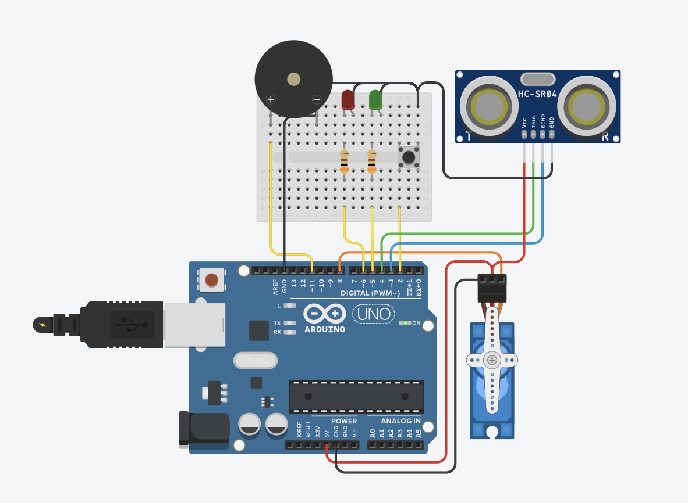
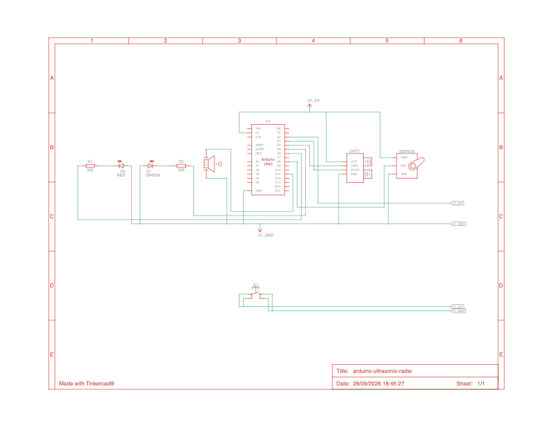

# Arduino Ultrasonic Radar & Tactical Security System


Système de détection périmétrique et de radar motorisé sur **180°** conçu autour d'un **Arduino Uno** et d'une interface graphique temps réel développée sous **Processing**. Le dispositif combine télémétrie ultrasonore, alertes matérielles (LEDs + Buzzer), un interrupteur logiciel **« Silence Tactique »** et une visualisation radar persistante.

---

## Sommaire
1. [Aperçu et Démonstrations Vidéo](#aperçu-et-démonstrations-vidéo)
2. [Architecture du Projet](#architecture-du-projet)
3. [Schémas de Câblage et Électronique](#schémas-de-câblage-et-électronique)
4. [Fonctionnement Technique](#fonctionnement-technique)
5. [Installation et Démarrage](#installation-et-démarrage)
6. [Dépannage (Troubleshooting)](#dépannage-troubleshooting)

---

## Aperçu et Démonstrations Vidéo

| Démonstration de l'Interface Radar (Processing) | Démonstration du Montage Matériel (Arduino) |
| :---: | :---: |
| 🎥 **[Lire la vidéo `radar_gui_demo.mov`](assets/radar_gui_demo.mov)** | 🎥 **[Lire la vidéo `arduino_setup_demo.mov`](assets/arduino_setup_demo.mov)** |
| *Balayage temps réel, détection de cible (< 40 cm) et persistance* | *Rotation du servomoteur (15°–165°), LEDs d'état et bouton muet* |

---

## Architecture du Projet

```text
arduino-ultrasonic-radar/
├── .gitignore                        # Exclusion des fichiers système macOS (.DS_Store) et builds
├── README.md                         # Documentation complète du projet
├── arduino_firmware/
│   └── arduino_firmware.ino          # Firmware C++ (Pilotage Servo, télémétrie HC-SR04, alertes)
├── assets/
│   ├── arduino_setup_demo.mov        # Vidéo du montage physique en fonctionnement
│   ├── arduino_wiring.png            # Schéma de câblage sur breadboard (Tinkercad Circuits)
│   ├── bom_components.csv            # Nomenclature des composants (Bill of Materials)
│   ├── electrical_schematic.pdf      # Schéma électrique normé (format vectoriel PDF)
│   ├── electrical_schematic.png      # Schéma électrique normé (aperçu direct)
│   └── radar_gui_demo.mov            # Enregistrement d'écran de l'interface Processing
└── processing_radar_gui/
    └── processing_radar_gui.pde      # Interface graphique Java/Processing (Radar & Mode Bombe)
```

---

## Schémas de Câblage et Électronique

### 1. Montage sur Breadboard (Vue Câblage Arduino)


### 2. Schéma Électrique Normé


* 📄 **[Télécharger le schéma électrique haute définition (PDF)](assets/electrical_schematic.pdf)**
* 📋 **[Consulter la liste des composants / Bill of Materials (CSV)](assets/bom_components.csv)**

### 3. Schéma Synoptique et Brochage (Pinout)

```text
                          +-----------------------+
                          |      ARDUINO UNO      |
                          +-----------------------+
  [Bouton Poussoir] <-----| D2 (INPUT_PULLUP)     |
                          |                       |
     [HC-SR04 Echo] <-----| D3                    |
     [HC-SR04 Trig] <-----| D4                5V  |-----> Rail +5V (HC-SR04 + Servo)
                          |                  GND  |-----> Masse commune (Tous composants)
        [LED Verte] <-----| D5 (via R = 220 Ω)    |
        [LED Rouge] <-----| D6 (via R = 220 Ω)    |
                          |                       |
      [Servomoteur] <-----| D8 (Signal PWM)       |
                          |                       |
     [Buzzer Actif] <-----| D11 (+)               |
                          +-----------------------+
```

| Composant | Broche Arduino | Détails Électriques et Rôle |
|---|---|---|
| **Bouton Poussoir (`S1`)** | `Pin 2` | Mode « Silence Tactique ». Utilise la résistance interne `INPUT_PULLUP` (branché entre `D2` et `GND`). |
| **Capteur HC-SR04 (`Echo`)** | `Pin 3` | Mesure la durée de l'impulsion haute (`pulseIn`) avec un timeout de sécurité de `30 000 µs`. |
| **Capteur HC-SR04 (`Trig`)** | `Pin 4` | Envoie une impulsion ultrasonore de `10 µs` à `40 kHz`. |
| **LED Verte (`D1`)** | `Pin 5` | Allumée lorsque la zone est dégagée (distance >= 40 cm ou hors de portée). Résistance série de 220 Ω. |
| **LED Rouge (`D2`)** | `Pin 6` | Allumée en cas d'intrusion (0 < distance < 40 cm). Résistance série de 220 Ω. |
| **Servomoteur (`SERVO1`)** | `Pin 8` | Effectue un balayage continu aller-retour entre **15° et 165°** (pas de 1° toutes les 20 ms). |
| **Buzzer (`Buzzer`)** | `Pin 11` | Alarme sonore activée si distance < 40 cm **ET** que `buzzerAutorise == true`. |

---

## Fonctionnement Technique

### 1. Calcul de la distance par ultrasons (Arduino)
À chaque degré d'angle du servomoteur, le capteur HC-SR04 émet une onde sonore. La vitesse du son dans l'air étant d'environ 340 m/s (soit 0,034 cm/µs), la distance aller-retour est calculée par la formule :

$$\text{Distance (cm)} = \frac{\text{Durée (\mu s)} \times 0,034}{2}$$

### 2. Interrupteur logiciel « Silence Tactique » avec anti-rebond
À chaque cycle (`faireUnCycle`), l'Arduino lit l'état de la broche `D2`. Grâce à une détection de front descendant (`etatBouton == LOW && dernierEtatBouton == HIGH`) combinée à un délai anti-rebond de `50 ms`, une simple pression inverse l'état booléen `buzzerAutorise` (`ON <-> OFF`), permettant de couper l'alarme sonore tout en conservant l'alerte visuelle (LED rouge + écran radar).

### 3. Protocole de communication Série (Arduino vers Processing)
Les données sont transmises à **9600 bauds** via le port USB :
* **Trame Radar standard :** `angle,distance.` (ex. `90,24.`). Le caractère `.` sert de délimiteur de fin de paquet (`monPort.bufferUntil('.')`).
* **Mémoire de persistance graphique :** Processing stocke l'historique des distances dans un tableau `float[] distHistory = new float[181]` pour maintenir l'affichage des obstacles détectés sur l'ensemble du demi-cercle de 180°.
* **Commandes étendues (Mode Sécurité / Bombe) :** L'interface Processing prend également en charge les trames spéciales `MODE,1.`, `B,timer.`, `BOOM.` et `RST.` pour basculer sur un écran de compte à rebours d'urgence.

---

## Installation et Démarrage

### Étape 1 : Téléverser le code Arduino
1. Ouvrir `arduino_firmware/arduino_firmware.ino` dans **Arduino IDE**.
2. Brancher la carte **Arduino Uno** en USB, sélectionner la carte et le port dans *Outils > Port*.
3. Cliquer sur **Téléverser**.
4. **Important :** Fermer le *Moniteur Série* d'Arduino IDE une fois le téléversement terminé (un port série ne peut être utilisé que par un seul logiciel à la fois).

### Étape 2 : Lancer l'interface graphique Processing
1. Ouvrir `processing_radar_gui/processing_radar_gui.pde` dans **Processing**.
2. Cliquer sur **Exécuter (Run)**.
3. Regarder la liste des ports affichée dans la console en bas de Processing (ex. `[5] "/dev/cu.usbserial-120"`).
4. Si le numéro correspondant à votre Arduino n'est pas `5`, modifier l'index à la ligne 23 :
   ```java
   String portName = Serial.list()[5]; // Remplacer 5 par l'index de votre port USB
   ```
5. Relancer le sketch pour voir le radar balayer en temps réel.

---

## Dépannage (Troubleshooting)

* **L'écran du radar s'ouvre mais la ligne verte ne bouge pas :**
  * Vérifiez que le *Moniteur Série* d'Arduino IDE est bien fermé.
  * Vérifiez que l'index dans `Serial.list()[x]` correspond bien au port `cu.usbmodem` ou `cu.usbserial` (macOS) ou `COMx` (Windows).
* **Erreur `Port busy` au lancement de Processing :**
  * Débranchez et rebranchez le câble USB de l'Arduino, puis relancez Processing.
* **Le servomoteur tremble ou fait redémarrer l'Arduino :**
  * Assurez-vous que vos câbles sur le rail `5V` et `GND` de la breadboard sont bien enfoncés.